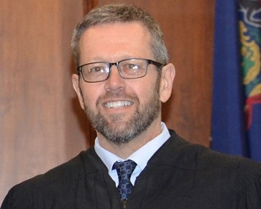
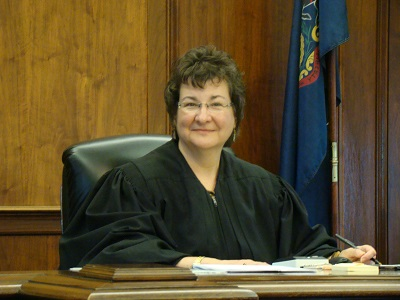

# Court Administrator’s Office

The Court Administrator, under the direction of the President Judge, oversees
the administration of the court and its various departments.

Any questions regarding scheduling of court proceedings and general court
operations should be directed to the staff of the Court Administrator’s
Office. They will be happy to assist you in any way that they can. However,
you should note that they _cannot_ provide legal advice. You should consult
with your attorney for assistance specific to your situation.

The Court Administrator’s Office for both Warren and Forest Counties is housed
at the Warren County Courthouse. The Judges and supporting staff all maintain
offices in Warren County.

## Contact Information

Court Administrator’s Office 
Warren County Courthouse 
204 Fourth Avenue 
Warren, PA 16365-2362

Phone: [814-728-3530](tel:+18147283530) 
Fax: [814-728-3452](tel:+18147283452) 

## Office Hours

8:30 AM &ndash; 4:30 PM Monday &ndash; Friday

## Location

The Office of the Court Administrator is located on the **second floor** of
the Warren County Courthouse and can be accessed by either elevator in the
building.

[:lucide-map: View a map]({{config.extra.map_urls.warren}}){ .md-button .md-button--primary target='_blank' }

## Court Calendar

/// html | div
    attrs:
        class: 'grid cards'
*   ### 2026 Annual Court Calendar

    [Download Now!](../documents/calendars/2026-Court-Calendar.pdf "2026 Annual Court Calendar"){ .md-button .md-button--secondary target="_blank" }
///

## Judges

/// details | ### The Honorable Gregory J. Hammond, President Judge { #judge-hammond }
    type: judge
    attrs:
        name: judge

{ .wrap }

Gregory J. Hammond was elected as Judge in November of 2009, and commenced
his first term in January of 2010. He was retained for a second ten-year
term in November of 2019, receiving the highest percentage of retention
votes in the state. Judge Hammond became the 27th President Judge on January
1, 2026.

Judge Hammond practiced law in Warren County from 1983 until taking the bench,
serving as Solicitor for Warren County Children and Youth Services, Solicitor
for the City of Warren and Mental Health Review Officer for the Court in
addition to his private practice.

Judge Hammond was born and raised in Corry, Pennsylvania. He graduated from
Corry Area High School in 1976, Dickinson College in 1980, and the University
of Pittsburgh School of Law in 1983, having earned Law Review honors.

Judge Hammond is married to Jackie (Collins) Hammond and they are the parents
of two daughters, Madison Gurdak and Logan Hammond, and one grandson, Gray
Gurdak.
///

/// details | ### The Honorable Todd Woodin, Judge { #judge-woodin }
    type: judge
    attrs:
        name: judge

Todd Woodin was elected as Judge in November of 2025, and commenced his first
term in January of 2026.
///

/// details | ### The Honorable Maureen A. Skerda, Senior Judge { #judge-skerda }
    type: judge
    attrs:
        name: judge

{ .wrap }

Maureen A. Skerda was elected as the first female Judge of the 37th Judicial
District and began her term of office in January of 2006. Judge Skerda
served as the President Judge from 2010 through 2025 and became a Senior
Judge in January of 2026.

She practiced law in Warren and Forest Counties since 1988 as a staff attorney
at Northwest Legal Services, Assistant District Attorney and served as Court
Hearing Officer from 1992 through 2005.

Judge Skerda is a graduate of Rosary High School, Aurora, Illinois, Illinois
Wesleyan University and the Antioch School of Law in Washington, D.C. Prior
to assuming the bench, she served for 17 years as a Master in Divorce and
Equitable Distribution, Support matters, juvenile dependency and delinquency
matters.

Judge Skerda is a member of the Pennsylvania Bar Association, Pennsylvania
State Conference of Trial Judges, and the Juvenile Court Judges Commission.
She participates in the Regional and Local Leadership Roundtables and the
Autism Committee on Juvenile Dependency issues. Judge Skerda has also
initiated a Local Treatment Court.

She is active in her community and has served on a number of boards including
the MH/MR, ATOD, and CYS advisory boards, the Economic Opportunity Council,
Warren General Hospital’s Hospice Ethics Committee, and the Struthers Library
Theatre.

She is married and her family includes her husband, stepson, daughter-in-law
and three grandchildren.
///

## Supporting Staff

### Jessica Arnold &mdash; Court Administrator

-   Phone [814-728-3531](tel:+18147283531)
-   Email: <jarnold@warrencountypa.gov>

### Tyra Olson &mdash; Deputy Court Administrator

-   Phone [814-728-3530](tel:+18147283530)
-   Email: <tolson@warrencountypa.gov>

### Gabrielle Carlson &mdash; Deputy Court Administrator

-   Phone [814-728-3533](tel:+18147283533)
-   Email: <gacarlson@warrencountypa.gov>

### Jackie Sherwood &mdash; Court Reporter

-   Phone [814-728-3532](tel:+18147283532)
-   Email: <jsherwood@warrencountypa.gov>

### Megan Andrews &mdash; Law Clerk

-   Phone [814-728-3449](tel:+18147283449)
-   Email: <mandrews@warrencountypa.gov>

## Tip Staff

#### Warren County

-   Sue Unen
-   Larry Sutton
-   Gary Wallin
-   Rodney Hoffman
-   Patricia Hemmerly
-   Dee Klakamp
-   Paula King

#### Forest County

-   Marion Sherwood
-   Kathy Hall
